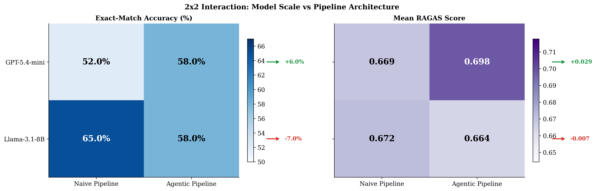

# Scale vs. Architecture: A 2×2 Empirical Study of RAG

> **Does an agentic self-correction pipeline always beat a simpler one? Does a bigger model?**
> This project answers both questions with a controlled 2×2 factorial experiment.

[](agentic-rag-arxiv/main.tex)

---

## Experimental Design

Four systems cross two model families with two pipeline architectures:

|  | **Naive Pipeline** | **Agentic Pipeline** |
|---|:---:|:---:|
| **GPT-5.4-mini** | System A — Goliath | System D — Titan |
| **Llama-3.1-8B** | System C — Hermes | System B — David |

All four systems share identical embeddings, vector store, retrieval configuration, and benchmark — isolating model choice and pipeline architecture as the sole independent variables.

---

## Results

Evaluated on **100 questions** from the HotpotQA distractor benchmark (seed = 42):

### Exact-Match Accuracy

| System | Model | Pipeline | Overall | Bridge | Comparison |
|---|---|---|:---:|:---:|:---:|
| A — Goliath | GPT-5.4-mini | Naive | 52.0% | 50.0% | 64.3% |
| B — David | Llama-3.1-8B | Agentic | 58.0% | 55.8% | 71.4% |
| **C — Hermes** | **Llama-3.1-8B** | **Naive** | **65.0%** | **64.0%** | **71.4%** |
| D — Titan | GPT-5.4-mini | Agentic | 58.0% | 55.8% | 71.4% |

### RAGAS Metrics (judge: GPT-5.4)

| Metric | A — Goliath | B — David | C — Hermes | D — Titan |
|---|:---:|:---:|:---:|:---:|
| Faithfulness | 0.603 | 0.714 | **0.733** | 0.643 |
| Answer Relevancy | 0.660 | 0.516 | 0.541 | **0.688** |
| Context Precision | 0.664 | 0.688 | 0.652 | **0.690** |
| Context Recall | 0.750 | 0.740 | 0.760 | **0.770** |

### The Key Finding — Interaction Effect

The agentic pipeline is **not model-agnostic**:

| | Naive → Agentic |
|---|:---:|
| GPT-5.4-mini | +6.0 pp |
| Llama-3.1-8B | −7.0 pp |

**13 pp interaction term.** Agentic self-correction helps the more capable model but hurts the smaller one — suggesting a capability threshold for productive self-correction. All four systems achieved **100% completion** by running Llama on a local GPU (NVIDIA Tesla T4 via Ollama), eliminating the rate-limit failures of earlier work.

---

## Charts

### Exact-Match Accuracy by Question Type


### RAGAS Evaluation — All Four Systems


### 2×2 Interaction: Model Scale vs Pipeline Architecture


### Agentic Loop Behaviour — Systems B and D


---

## Systems

| | A — Goliath | B — David | C — Hermes | D — Titan |
|---|---|---|---|---|
| **Model** | GPT-5.4-mini | Llama-3.1-8B | Llama-3.1-8B | GPT-5.4-mini |
| **Pipeline** | Naive RAG | Agentic RAG | Naive RAG | Agentic RAG |
| **Orchestration** | LangChain | LangGraph | LangChain | LangGraph |
| **Self-correction** | None | Doc grading + query rewriting + hallucination check | None | Doc grading + query rewriting + hallucination check |

### Agentic Pipeline (Systems B and D)

```
Question
   │
   ▼
Retrieve (ChromaDB, top-5)
   │
   ▼
Grade Documents ──── < 50% relevant? ──── Rewrite Query ──┐
   │                                                       │
   │ ≥ 50% relevant (or max 3 retries)               (loop back)
   ▼
Generate Answer
   │
   ▼
Check Hallucination ──── not grounded? ──── (regenerate, max 2×)
   │
   ▼
Answer
```

---

## Benchmark

**HotpotQA** — distractor setting, validation split

| Parameter | Value |
|---|---|
| Questions sampled | 100 (seed = 42) |
| Paragraphs ingested | 1,000 (100 × 10) |
| Gold paragraphs per question | 2 |
| Distractor paragraphs per question | 8 |
| Question types | Bridge (86), Comparison (14) |
| Difficulty | Hard (all) |

---

## Project Structure

```
agentic-rag-vs-scale/
├── config.py                        # Central configuration (all models, limits, paths)
├── requirements.txt                 # Dependencies
├── .env.example                     # API key template
├── check_apis.py                    # Test OpenAI, Groq, and Ollama backends
│
├── ingestion/
│   └── ingest_hotpotqa.py           # Download HotpotQA + build ChromaDB corpus
│
├── systems/
│   ├── llm_factory.py               # LLM backend selector (Groq / Ollama / local GPU)
│   ├── system_a_goliath.py          # Naive RAG + GPT-5.4-mini
│   ├── system_b_david.py            # Agentic RAG + Llama-3.1-8B
│   ├── system_c_hermes.py           # Naive RAG + Llama-3.1-8B
│   └── system_d_titan.py            # Agentic RAG + GPT-5.4-mini
│
├── evaluation/
│   ├── load_benchmark.py            # Load sampled questions
│   ├── run_tournament.py            # Run all four systems on all questions
│   ├── evaluate_ragas.py            # Score with RAGAS 0.4.x framework
│   ├── visualize_results.py         # Generate publication charts
│   └── results/                     # Output JSON, CSV, and PNG files
│
└── agentic-rag-arxiv/
    └── main.tex                     # LaTeX research paper
```

---

## Quick Start

### 1. Clone and install

```bash
git clone https://github.com/AhmadTawil1/agentic-rag-vs-scale.git
cd agentic-rag-vs-scale
pip install -r requirements.txt
```

### 2. Set API keys

```bash
copy .env.example .env
```

Edit `.env`:
```
OPENAI_API_KEY=your_openai_key
GROQ_API_KEY=your_groq_key          # for Llama via Groq (optional)
GROQ_API_KEY_2=your_backup_groq_key # backup key (optional)
```

To run Llama locally via Ollama instead of Groq (recommended — no rate limits):
```
USE_OLLAMA=true
```

### 3. Build the corpus

Downloads HotpotQA from HuggingFace and ingests 1,000 paragraphs into ChromaDB.

```bash
python ingestion/ingest_hotpotqa.py
```

### 4. Run the tournament

```bash
python evaluation/run_tournament.py
```

All four systems answer all 100 questions. Results are saved to `evaluation/results/`.

> **Llama rate limits:** Systems B and C each make multiple LLM calls per question.
> Running on Groq's free tier will hit daily token limits.
> Use `USE_OLLAMA=true` with a local GPU (≥8 GB VRAM) to eliminate this constraint entirely.

### 5. Evaluate with RAGAS

Run locally after downloading the result JSON files:

```bash
python evaluation/evaluate_ragas.py \
  --system-a evaluation/results/system_a_results_<TIMESTAMP>.json \
  --system-b evaluation/results/system_b_results_<TIMESTAMP>.json \
  --system-c evaluation/results/system_c_results_<TIMESTAMP>.json \
  --system-d evaluation/results/system_d_results_<TIMESTAMP>.json
```

### 6. Generate charts

```bash
python evaluation/visualize_results.py \
  --system-a evaluation/results/system_a_results_<TIMESTAMP>.json \
  --system-b evaluation/results/system_b_results_<TIMESTAMP>.json \
  --system-c evaluation/results/system_c_results_<TIMESTAMP>.json \
  --system-d evaluation/results/system_d_results_<TIMESTAMP>.json \
  --comparison-csv evaluation/results/comparison.csv \
  --output-dir evaluation/results
```

---

## Configuration

Key parameters in `config.py`:

| Parameter | Default | Description |
|---|:---:|---|
| `HOTPOTQA_SAMPLE_SIZE` | `100` | Questions sampled from validation split |
| `HOTPOTQA_SEED` | `42` | Random seed for reproducibility |
| `RETRIEVAL_TOP_K` | `5` | Documents retrieved per query |
| `MAX_RETRIEVAL_LOOPS` | `3` | Max query rewrites (agentic systems) |
| `MAX_GENERATION_RETRIES` | `2` | Max regeneration attempts (agentic systems) |
| `GOLIATH_MODEL` | `gpt-5.4-mini` | System A model |
| `TITAN_MODEL` | `gpt-5.4-mini` | System D model |
| `DAVID_MODEL` | `llama-3.1-8b-instant` | System B model (via Groq) |
| `HERMES_MODEL` | `llama-3.1-8b-instant` | System C model (via Groq) |
| `EVALUATOR_MODEL` | `gpt-5.4` | RAGAS judge model |
| `EMBEDDING_MODEL` | `all-MiniLM-L6-v2` | Shared embedding model (local) |

---

## Paper

The full research paper is in [`agentic-rag-arxiv/main.tex`](agentic-rag-arxiv/main.tex).

To compile (requires [MiKTeX](https://miktex.org/download) or [Overleaf](https://www.overleaf.com)):

```bash
cd agentic-rag-arxiv
pdflatex main.tex
pdflatex main.tex   # second pass for cross-references
```

---

## Author

**Ahmad Tawil** — ahmadtawil.se@gmail.com

---

## License

This project is licensed under the [MIT License](LICENSE) — © 2026 Ahmad Tawil.
