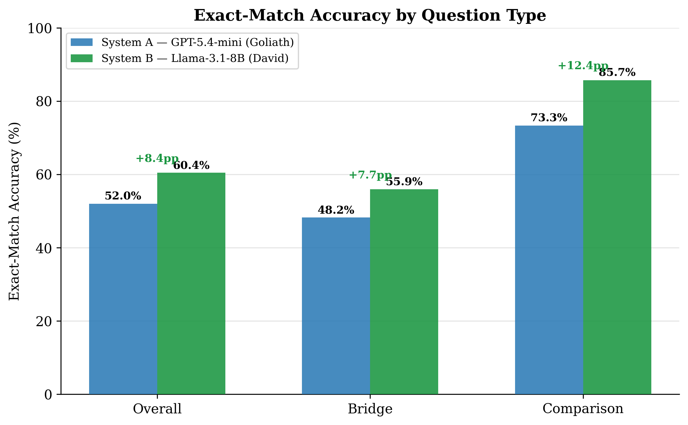
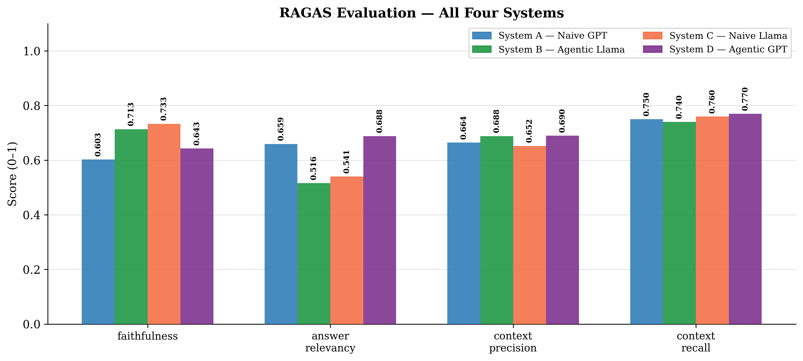
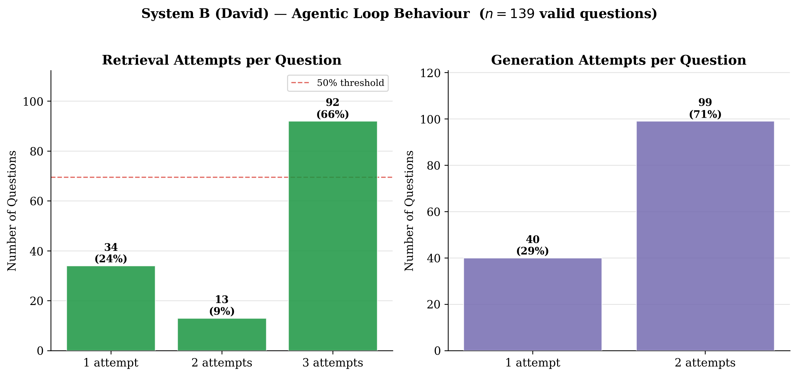
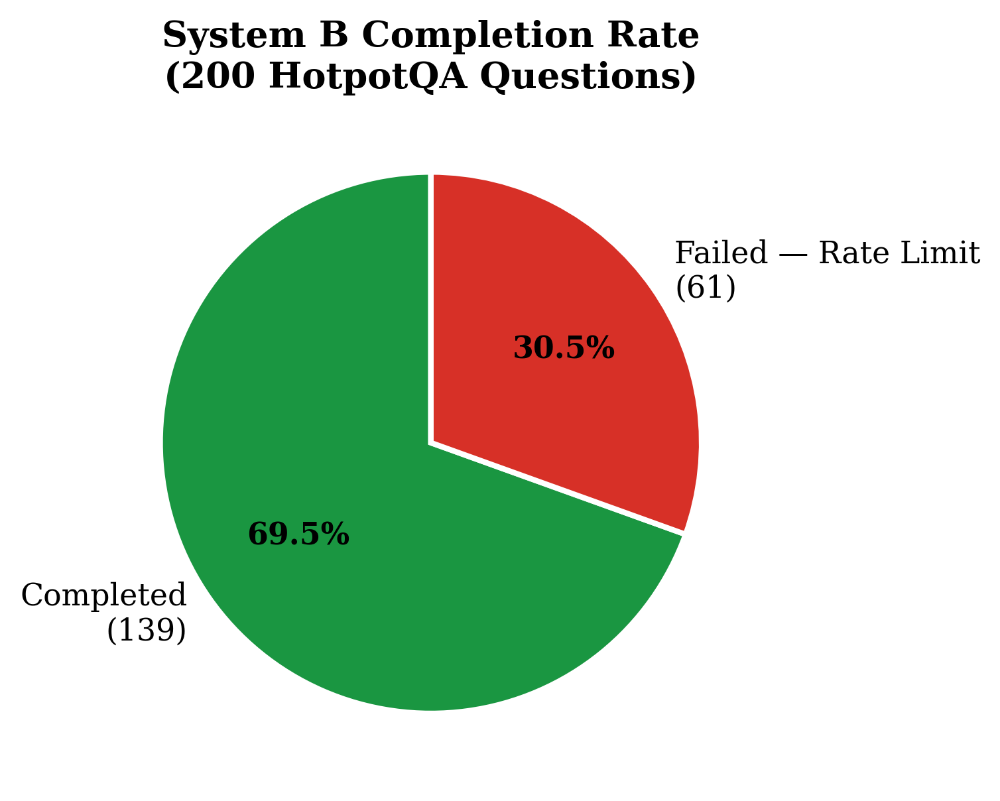

# David vs. Goliath: Agentic RAG vs. Model Scale

> **Can an 8B model with agentic self-correction outperform a frontier model on multi-hop QA?**
> This project answers that question empirically.

---

## Results

Evaluated on **200 questions** from the HotpotQA distractor benchmark:

| Metric | System A — Goliath | System B — David | Winner |
|---|:---:|:---:|:---:|
| Exact Match (overall) | 52.0% | **60.4%** | David |
| Exact Match (bridge) | 48.2% | **55.9%** | David |
| Exact Match (comparison) | 73.3% | **85.7%** | David |
| RAGAS Faithfulness | 0.645 | **0.683** | David |
| RAGAS Context Recall | 0.735 | **0.777** | David |
| Completion Rate | **100%** | 69.5% | Goliath |

**System B wins on every accuracy metric** despite using a model ~25× smaller. System A wins on reliability — System B exhausted Groq's daily token limit due to its multi-step pipeline (~8× more LLM calls per question).

### Exact-Match Accuracy by Question Type


### RAGAS Evaluation


### System B — Agentic Loop Behaviour


### System B — Completion Rate


---

## Systems

| | System A — Goliath | System B — David |
|---|---|---|
| **Model** | GPT-5.4-mini (OpenAI) | Llama-3.1-8B (Groq) |
| **Pipeline** | Single-pass naive RAG | Agentic cyclic RAG |
| **Orchestration** | LangChain | LangGraph |
| **Self-correction** | None | Document grading + query rewriting + hallucination checking |
| **LLM calls / question** | 1 | ~8.3 (avg) |

### System B Pipeline

```
Question
   │
   ▼
Retrieve (ChromaDB, top-5)
   │
   ▼
Grade Documents ──── < 50% relevant? ──── Transform Query ──┐
   │                                                         │
   │ ≥ 50% relevant (or max 3 retries)                      │
   ▼                                                    (loop back)
Generate Answer
   │
   ▼
Check Hallucination ──── not grounded? ──── (regenerate, max 2x)
   │
   ▼
 Answer
```

---

## Benchmark

**HotpotQA** — distractor setting, validation split

| Parameter | Value |
|---|---|
| Questions sampled | 200 (seed = 42) |
| Paragraphs ingested | 2,000 (200 × 10) |
| Gold paragraphs per question | 2 |
| Distractor paragraphs per question | 8 |
| Question types | Bridge (170), Comparison (30) |
| Difficulty | Hard (all) |

---

## Project Structure

```
agentic-rag-vs-scale/
├── config.py                        # Central configuration
├── requirements.txt                 # Dependencies
├── .env.example                     # API key template
│
├── ingestion/
│   └── ingest_hotpotqa.py           # Download HotpotQA + build ChromaDB corpus
│
├── systems/
│   ├── system_a_goliath.py          # Baseline naive RAG (GPT-5.4-mini)
│   └── system_b_david.py            # Agentic RAG (Llama-3.1-8B via Groq)
│
├── evaluation/
│   ├── load_benchmark.py            # Load sampled questions
│   ├── run_tournament.py            # Run both systems on all questions
│   ├── evaluate_ragas.py            # Score with RAGAS framework
│   ├── visualize_results.py         # Generate publication charts
│   └── results/                     # Output JSON, CSV, and PNG files
│
└── agentic-rag-arxiv/
    └── main.tex                     # LaTeX research paper
```

---

## Quick Start

### 1. Clone and install

```bash
git clone https://github.com/AhmadTawil1/agentic-rag-vs-scale.git
cd agentic-rag-vs-scale
pip install -r requirements.txt
```

### 2. Set API keys

```bash
copy .env.example .env
```

Edit `.env`:
```
OPENAI_API_KEY=your_openai_key
GROQ_API_KEY=your_groq_key
```

### 3. Build the corpus

Downloads HotpotQA from HuggingFace and ingests 2,000 paragraphs into ChromaDB.

```bash
python ingestion/ingest_hotpotqa.py
```

### 4. Run the tournament

```bash
python evaluation/run_tournament.py
```

Both systems answer all 200 questions. Results are saved to `evaluation/results/`.

> **Note:** System B makes ~8× more LLM calls per question than System A.
> On Groq's free tier, 200 questions may exhaust the daily token limit.
> Consider using a paid tier or reducing `HOTPOTQA_SAMPLE_SIZE` in `config.py`.

### 5. Evaluate with RAGAS

```bash
python evaluation/evaluate_ragas.py \
  --system-a evaluation/results/system_a_results_<TIMESTAMP>.json \
  --system-b evaluation/results/system_b_results_<TIMESTAMP>.json
```

### 6. Generate charts

```bash
python evaluation/visualize_results.py \
  --system-a evaluation/results/system_a_results_<TIMESTAMP>.json \
  --system-b evaluation/results/system_b_results_<TIMESTAMP>.json \
  --comparison-csv evaluation/results/comparison.csv \
  --output-dir evaluation/results
```

---

## Configuration

Key parameters in `config.py`:

| Parameter | Default | Description |
|---|:---:|---|
| `HOTPOTQA_SAMPLE_SIZE` | `200` | Questions sampled from validation split |
| `HOTPOTQA_SEED` | `42` | Random seed for reproducibility |
| `RETRIEVAL_TOP_K` | `5` | Documents retrieved per query |
| `MAX_RETRIEVAL_LOOPS` | `3` | Max query rewrites in System B |
| `MAX_GENERATION_RETRIES` | `2` | Max regeneration attempts in System B |
| `GOLIATH_MODEL` | `gpt-5.4-mini` | System A LLM |
| `EMBEDDING_MODEL` | `all-MiniLM-L6-v2` | Shared embedding model |

---

## Paper

The full research paper is in `agentic-rag-arxiv/main.tex`.

To compile (requires [MiKTeX](https://miktex.org/download) or [Overleaf](https://www.overleaf.com)):

```bash
cd agentic-rag-arxiv
pdflatex main.tex
pdflatex main.tex
```

---

## Author

**Ahmad Tawil** — ahmadtawil.se@gmail.com

---

## License

This project is licensed under the [MIT License](LICENSE) — © 2026 Ahmad Tawil.
